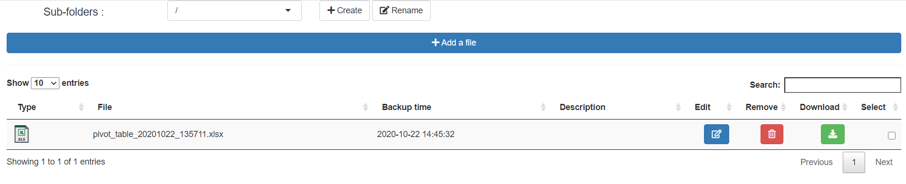
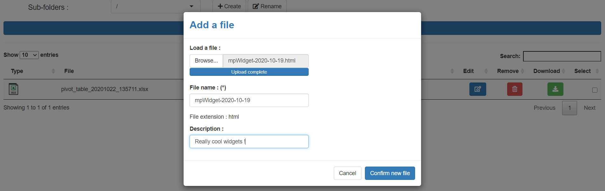
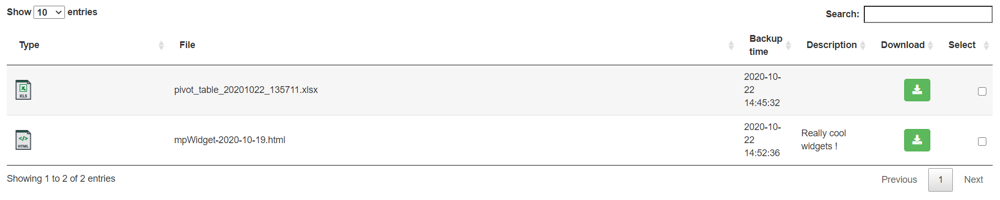
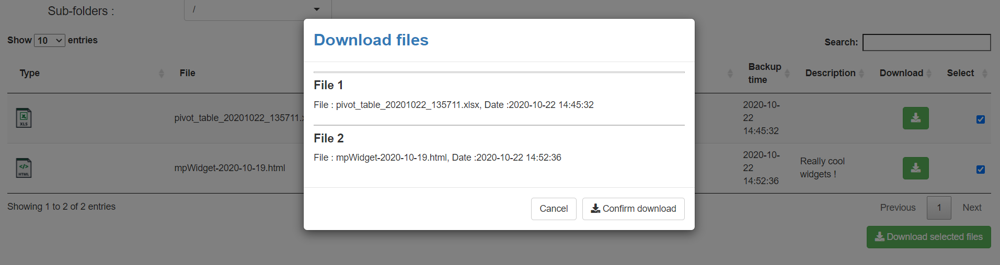

# shinydrive


R package with a simple ``Shiny module`` for easily sharing files.

**Admin** can manage directories & files (add, remove, edit, ...)

**User** can only download files

- files are copied into target directory
- we add date/time to filename on the drive
- use a ``yaml`` file to save informations


### Installation

You can install:

-   the latest development version from GitHub with

``` r
devtools::install_github("datastorm-open/shinydrive")
```

### Demo application

``` r
runApp(system.file("demo_app", package = "shinydrive"))
```

### Example

``` r
require(shinydrive)

ui <- fluidPage(
    shiny_drive_ui(id = "idm")
)
server <- function(input, output, session) {
    callModule(module = shiny_drive_server,
             id = "idm",
             session = session,
             admin_user = TRUE,
             save_dir =  getwd(),
             lan = "EN")
}

shinyApp(ui, server)
```

**Admin view**





**User view**




