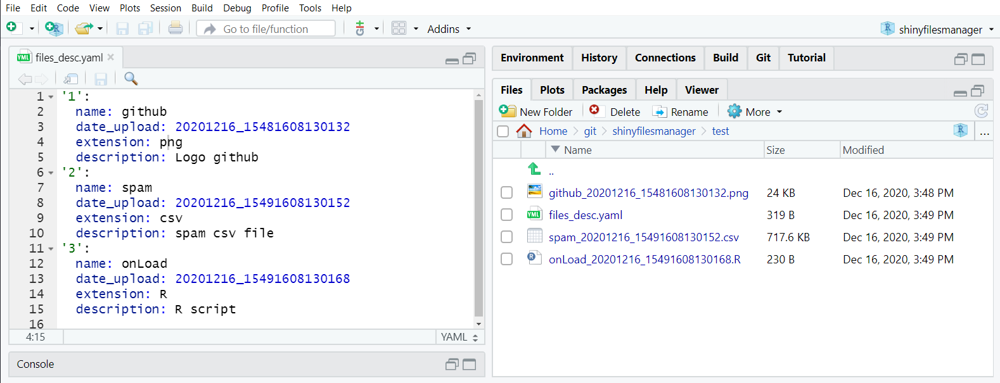
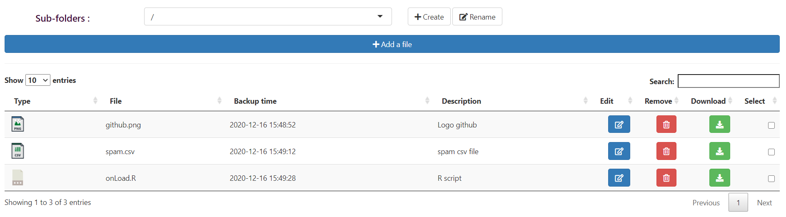
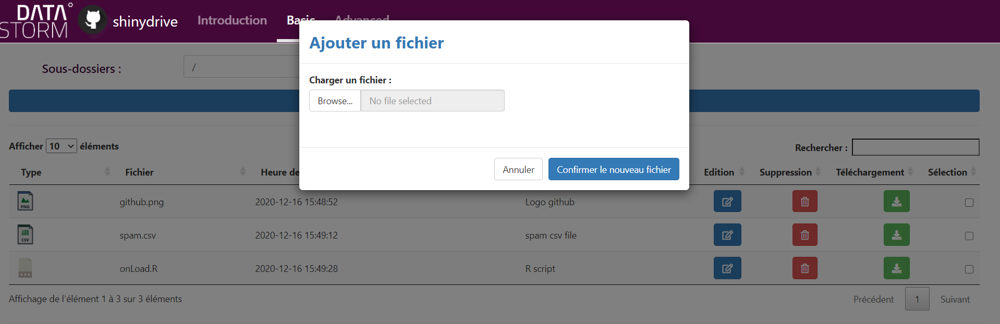
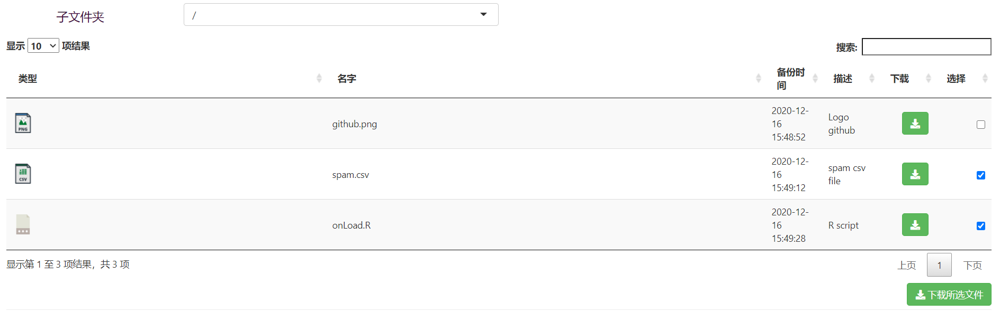

# shinydrive

Dans la famille des packages **shiny** chez **Datastorm**, je demande le petit dernier, à savoir **shinydrive**.

Le package **shinydrive** a été développé pour répondre à un besoin simple : faciliter le partage de fichiers entre différents utilisateurs d'une application **R/shiny**. Il se compose : 

- d'un module **shiny** à insérer en quelques lignes de code et disposant de deux rôles : 
    + **l'administrateur** qui peut de son côté ajouter / modifier / supprimer des fichiers disponibles ensuite en téléchargement, et créer si besoin également des sous-dossiers
    + **le lecteur** qui peut uniquement télécharger un ou plusieurs fichiers disponibles

- de 3 fonctions **R** permettant si besoin de gérer les fichiers en dehors de l'application **shiny** (génération quotidienne d'un rapport *via* un batch par exemple, et mise à disposition automatique dans l'application)  :
    + ``add_file_in_dir`` pour ajouter un nouveau fichier
    + ``edit_file_in_dir`` pour éditer un fichier existant
    + ``suppress_file_in_dir`` pour supprimer un fichier 

Le fonctionnement du package est le suivant : 

- Le module se branche à un répertoire existant
- La gestion des fichiers importés se fait ensuite *via* un fichier ``yaml`` permettant de stocker : 
    + le nom d'origine du fichier ainsi que sa date et heure de mise à disposition. Cela permet notamment de renommer les fichiers dans le répertoire de stockage en évitant les conflits dans le cas où l'administrateur ajouterait deux fichiers portant le même nom. Cette étape de renommage est totalement transparente pour le lecteur qui retrouvera bien le fichier avec le nom d'origine lors du téléchargement
    + le type de fichier
    + une description optionnelle de son contenu



Côté **shiny**, nous retrouvons une interface claire et épurée, disponible actuellement en trois langues (français, anglais et chinois), et qui se présente sous cette forme : 

**administateur**

*Vue des fichiers, avec la possibilité de les éditer / supprimer / télécharger* 



*Popup pour l'insertion d'un nouveau fichier* 




**lecteur**

*Uniquement la possibilité de télécharger les fichiers* 



*N.B : La dernière colonne du tableau, composée de *checkbox*, permet de sélectionner plusieurs fichiers afin de tous les télécharger ou les supprimer (administrateur)*

### Installation

Le package devrait arriver dans les prochaines semaines sur le **CRAN**. En attendant, vous pouvez l'installer directement depuis notre gitub https://github.com/datastorm-open : 

``` r
if(!require(devtools)) install.packages("devtools")
devtools::install_github("datastorm-open/shinydrive")
```

### Application de démonstration

Une application de démonstration est disponible 

- directement dans le package : 

``` r
runApp(system.file("demo_app", package = "shinydrive"))
```

- en ligne à l'adresse suivante : https://datastorm-demo.shinyapps.io/shinydrive/

- et dans la vidéo ci-dessous

### Utilisation

En insérant tout simplement le module dans votre application **shiny**, avec l'utilisation des deux fonctions suivantes : 

- ``shiny_drive_ui`` : dans le script *ui.R*, avec uniquement l'identifiant du module à renseigner
- ``shiny_drive_server`` : dans la partie du *server.R* avec à minima :
    + l'identifiant du module (id)
    + ainsi que le répertoire de stockage (save_dir)
    
En complément, il est possible de : 

  + définir le rôle, administrateur ou lecteur (admin_user)
  + la langue (lan)
  + de forcer le remplissage du champ "description" lors de l'insertion d'un nouveau fichier (force_desc)
  + et de restreindre les accès à un sous-ensemble de sous-dossiers si nécessaire (dir_access)


``` r
require(shinydrive)

ui <- fluidPage(
    shiny_drive_ui(id = "idm")
)

server <- function(input, output, session) {
    callModule(module = shiny_drive_server,
             id = "idm",
             admin_user = TRUE,
             save_dir =  getwd(),
             lan = "EN")
}

shinyApp(ui, server)
```

L'ensemble des arguments peut être donner de façon *réactive* afin de gérer les différentes options en fonction du profil de l'utilisateur.

### Next steps

Perspectives d'évolutions d'ores et déjà identifiées : 

- chiffrement des fichiers
- logs de téléchargement
- Fonction de transformation du fichier avant téléchargement
